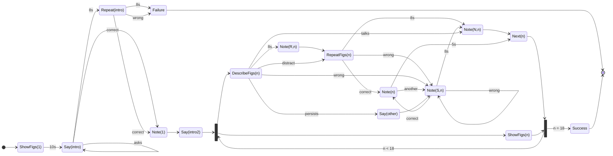
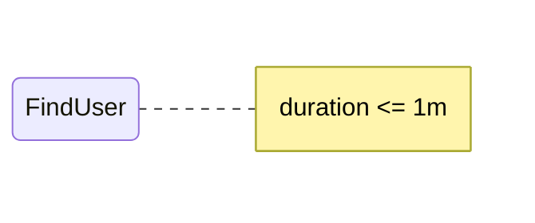
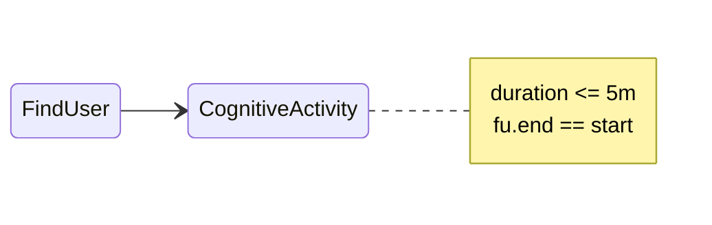
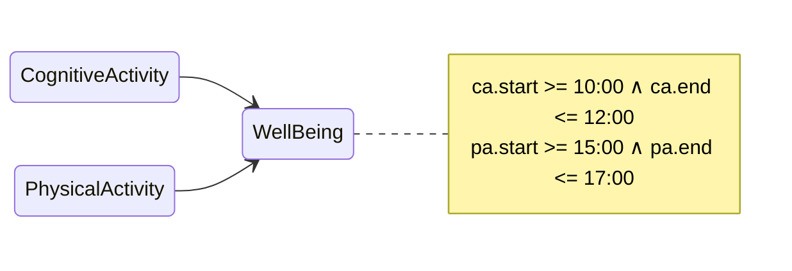
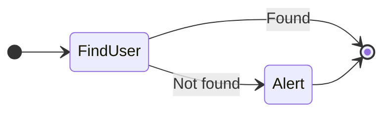
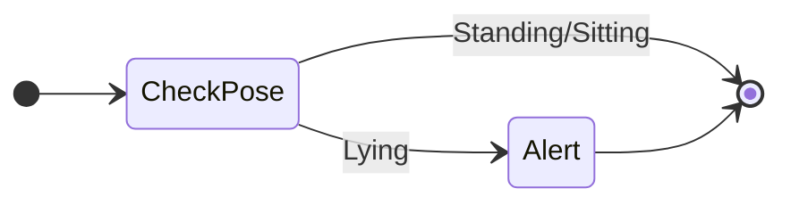
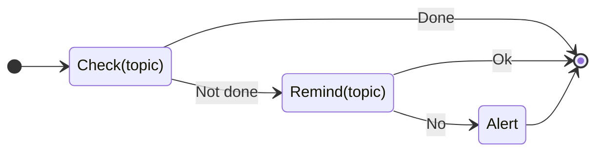
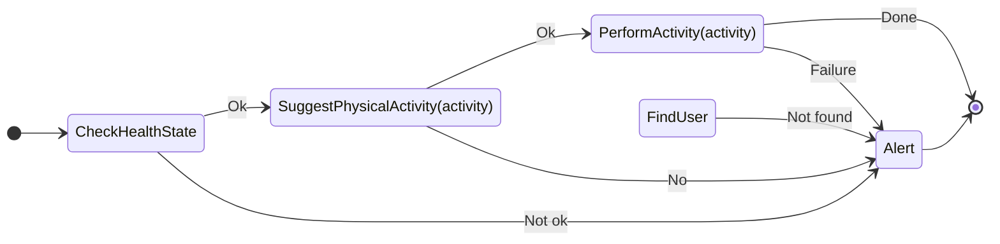
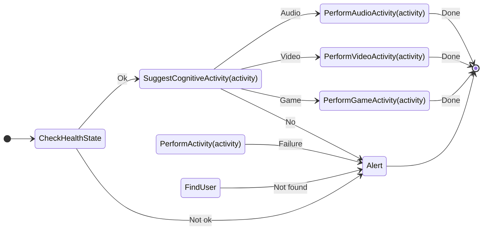

# Rules

This directory contains the rules for the RESTART project. There are two types of rules:

* **Deliberative rules**: These rules are used to plan activities.
* **Reactive rules**: These rules are triggered by events.

## Deliberative Rules

The following rules are defined:

* **FindUser**: Finds the user.
* **PhysicalActivity**: Plans a physical activity.
* **CognitiveActivity**: Plans a cognitive activity.
* **WellBeing**: Plans a well-being activity.

The following diagram describes the **FindUser** rule:

The following diagram describes the **PhysicalActivity** rule:

The following diagram describes the **CognitiveActivity** rule:

The following diagram describes the **WellBeing** rule:

The following diagram describes a possible plan for achieving a **WellBeing** goal:

```mermaid
gantt
    title A well being plan
    dateFormat HH:mm
    axisFormat %H:%M
    section Plan
        FindUser          :a1, 10:59, 1m
        CognitiveActivity :a2, after a1, 3m
        FindUser          :a3, 14:59, 1m
        PhysicalActivity  :a4, after a3, 4m
```

## Reactive Rules

The follwoing rules are defined:

* **FindUser**: Finds the user.
* **Awake**: Checks if the user is awake. If the user is lying down, the rule will trigger an alert.
* **Remind**: Reminds something to the user. If the user does not respond, the rule will trigger an alert.
* **PhysicalStimulation**: Stimulates the user to perform physical activity.
* **CognitiveStimulation**: Stimulates the user to perform cognitive activity.

The following diagram describes the **FindUser** rule:

The following diagram describes the **Awake** rule:

The following diagram describes the **Remind** rule:

The following diagram describes the **PhysicalStimulation** rule:

The following diagram describes the **CognitiveStimulation** rule:

## Low-level commands

The following low-level commands are defined:

* **FindUser**: Finds the user. The robot navigates inside the house until the user is found.
* **CheckPose**: Checks the user's pose. Through ... **what?**, the robot checks if the user is standing or sitting. If the user is lying down, the robot triggers an alert.
* **Check(topic)**: Checks if the user has done something. Through verbal interaction, the robot checks if the user has done something.
* **Remind(topic)**: Reminds something to the user. Through verbal interaction, the robot reminds something to the user.
* **SuggestPhysicalActivity(activity)**: Suggests a physical activity to the user. Through verbal interaction, the robot suggests a physical activity to the user.
* **SuggestCognitiveActivity(activity)**: Suggests a cognitive activity to the user. Through verbal interaction, the robot suggests a cognitive activity to the user.
* **PerformAudioActivity(activity)**: Performs an audio activity. The robot plays an audio.
* **PerformVideoActivity(activity)**: Performs a video activity. The robot plays a video.
* **PerformGameActivity(activity)**: Performs a game activity. The robot starts a game.
