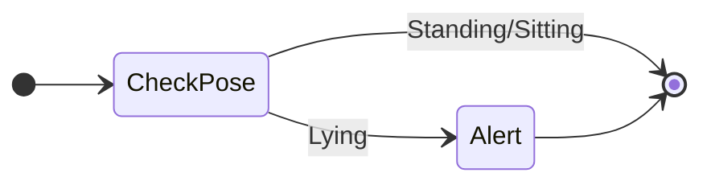
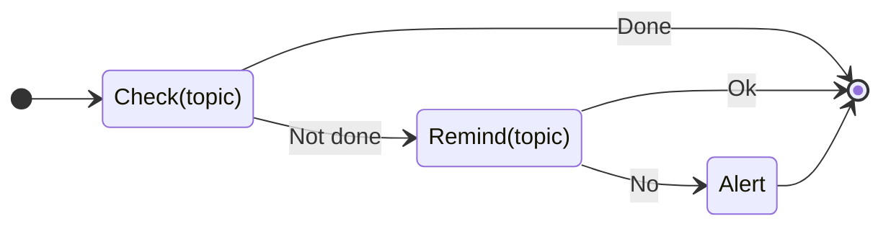
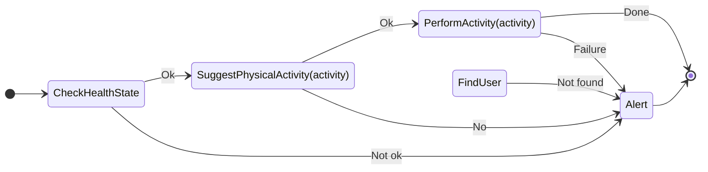
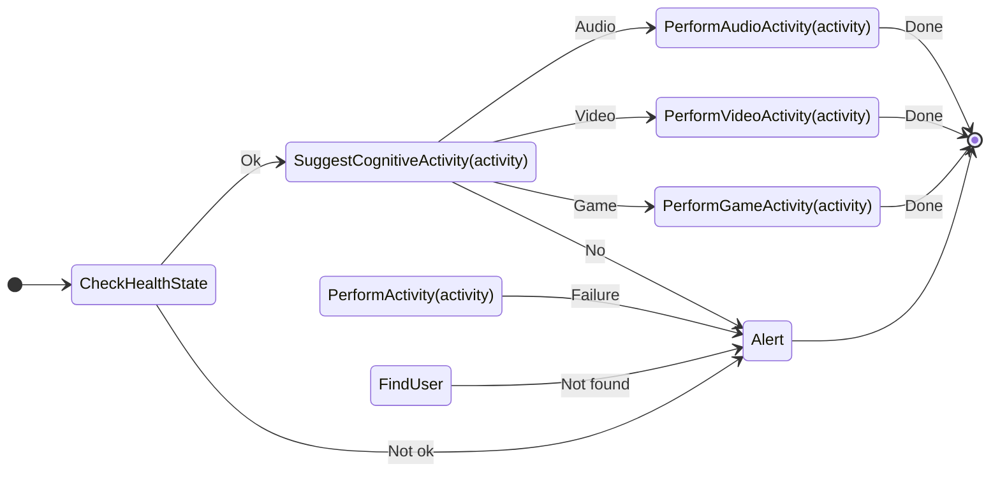
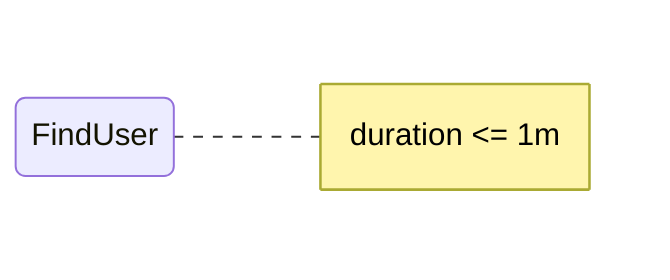
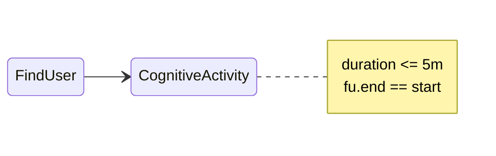

# Rules

This directory contains the rules for the RESTART project. There are two types of rules:

* **Reactive rules**: These rules are triggered by events.
* **Deliberative rules**: These rules are used to plan activities.

## Reactive Rules

The follwoing rules are defined:

* **Awake**: Checks if the user is awake. If the user is lying down, the rule will trigger an alert.
* **Remind**: Reminds something to the user. If the user does not respond, the rule will trigger an alert.
* **PhysicalStimulation**: Stimulates the user to perform physical activity.
* **CognitiveStimulation**: Stimulates the user to perform cognitive activity.

The following diagram describes the **Awake** rule:

The following diagram describes the **Remind** rule:

The following diagram describes the **PhysicalStimulation** rule:

The following diagram describes the **CognitiveStimulation** rule:

## Deliberative Rules

The following rules are defined:

* **FindUser**: Finds the user.
* **PhysicalActivity**: Plans a physical activity.
* **CognitiveActivity**: Plans a cognitive activity.
* **WellBeing**: Plans a well-being activity.

The following diagram describes the **FindUser** rule:

The following diagram describes the **PhysicalActivity** rule:

The following diagram describes the **CognitiveActivity** rule:

The following diagram describes the **WellBeing** rule:

